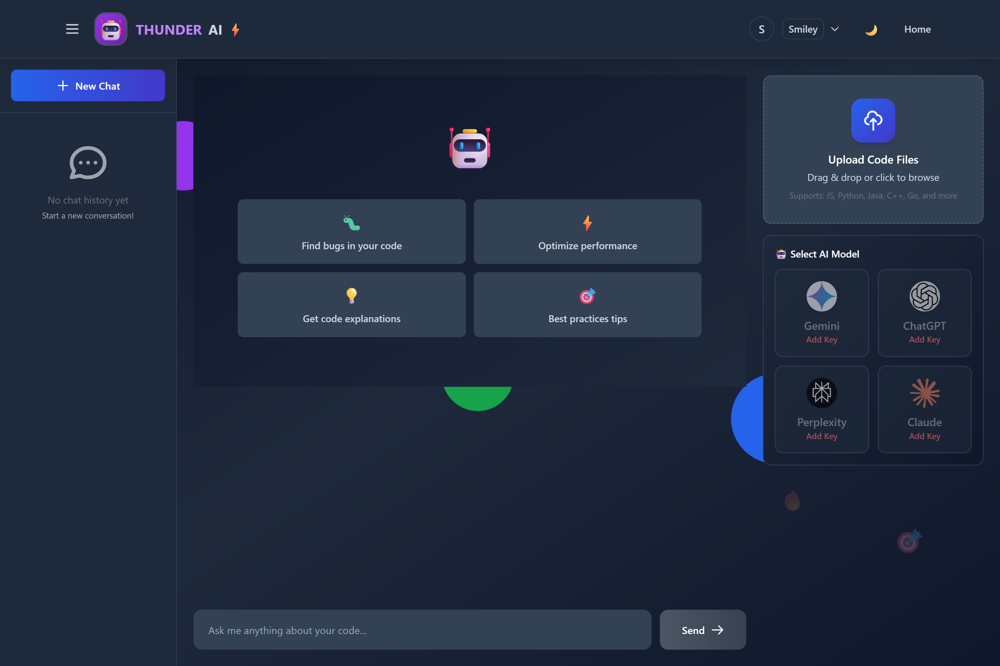

### Landing Page


### Chatbot Page



# ⚡ Thunder Bolt AI

**Your Multi-Model AI-Powered Code Assistant**

An interactive chat-based code assistant with support for multiple AI models including Gemini, ChatGPT, Claude, and Perplexity. Upload your code, ask questions, and get instant AI-powered insights with beautiful syntax highlighting and real-time processing feedback!

     

---

## 📸 Screenshots & Demo

### 🎨 Landing Page - Multi-AI Selection
## Screenshots

### Landing Page


Beautiful landing page with typing animation, floating elements, and smooth transitions
- Responsive design for all devices
- Real-time typing animation with typewriter effect
- Animated floating background elements
- AI model showcase cards
- One-click theme switching (Light/Dark/Neon)

### 💬 Chat Interface - Code Analysis
Full-featured chat interface for code analysis and Q&A
- Real-time AI responses with streaming
- Multiple file upload with drag-and-drop
- Chat history sidebar with manage options
- Live processing indicators
- Syntax highlighting for 100+ languages
- Copy-to-clipboard for code blocks

### 🔐 Authentication - Secure Login
Professional login and signup screens
- User registration with validation
- Secure JWT authentication
- Email verification ready
- API key management in settings

---

### AI Models Supported

| Model | Provider | Speed | Cost | Best For |
|-------|----------|-------|------|----------|
| **Gemini 1.5 Flash** | Google | ⚡ Fast | 🆓 Free | Quick responses, code generation |
| **Gemini 1.5 Pro** | Google | 🚀 Very Fast | 💰 Paid | Complex analysis, detailed explanations |
| **GPT-4** | OpenAI | ⚙️ Medium | 💰 Paid | Advanced reasoning, best quality |
| **GPT-3.5 Turbo** | OpenAI | ⚡ Fast | 💰 Paid | Balanced speed and quality |
| **Claude 3 Haiku** | Anthropic | ⚡ Fast | 💰 Paid | Code analysis, safe responses |
| **Llama 3.1 Sonar** | Perplexity | 🚀 Very Fast | 💰 Paid | Latest web knowledge, real-time info |
- **💬 Multi-AI Chat Interface** - Switch between Gemini, ChatGPT, Claude, and Perplexity
- **📁 File Upload System** - Upload and analyze multiple code files/folders
- **⚡ Real-time Responses** - Live streaming responses with visual feedback
- **💾 Chat History** - Save and manage multiple chat sessions
- **🔐 User Authentication** - Secure login and API key management
- **🎨 Theme Support** - Light, Dark, and Neon themes

### Advanced Features (NEW!)
- **✨ Syntax Highlighting** - Beautiful code highlighting with Prism.js for 100+ languages
- **� Markdown Support** - Full markdown rendering for AI responses
- **📋 Copy-to-Clipboard** - Easy code snippet copying with one click
- **⏱️ Processing Indicators** - Step-by-step visual feedback showing:
  - File uploading status with progress bar
  - File analysis progress
  - AI thinking/processing states
  - Response generation
- **🎯 Smart File Analysis** - AI automatically searches and analyzes uploaded files
- **📱 Responsive Design** - Works perfectly on mobile, tablet, and desktop

## 🚀 Quick Start

### Prerequisites
- Node.js 16+ installed
- MongoDB (local or MongoDB Atlas)
- API keys for AI models you want to use:
  - [Google Gemini API Key](https://makersuite.google.com/app/apikey) (Free tier available)
  - [OpenAI API Key](https://platform.openai.com/api-keys) (For ChatGPT)
  - [Anthropic API Key](https://console.anthropic.com/) (For Claude)
  - [Perplexity API Key](https://www.perplexity.ai/settings/api) (For Perplexity)

### Installation

1. **Clone the Repository**
```bash
git clone https://github.com/luvgupta014/chat-bot.git
cd chat-bot
```

2. **Install Backend Dependencies**
```bash
cd backend
npm install
```

3. **Install Frontend Dependencies**
```bash
cd frontend
npm install
```

4. **Configure Environment Variables**

Create `.env` file in the `backend` directory:
```env
MONGO_URI=your_mongodb_connection_string
JWT_SECRET=your_secret_key_change_this_in_production
PORT=5000
```

Create `.env` file in the `frontend` directory:
```env
REACT_APP_BACKEND_URL=http://localhost:5000
```

### Running the App

1. **Start MongoDB** (if running locally)
```bash
mongod
```

2. **Start Backend Server**
```bash
cd backend
npm start
```
Server runs on `http://localhost:5000`

3. **Start Frontend** (in a new terminal)
```bash
cd frontend
npm run dev
```
Frontend runs on `http://localhost:5173`

4. **Open in Browser**
- Navigate to `http://localhost:5173`
- Sign up for an account
- Add your API keys in Settings
- Start chatting! 🎉

## 🎮 How to Use

### First Time Setup
1. **Sign Up** - Create an account with your name, email, and password
2. **Add API Keys** - Click on your profile → Settings → Enter your AI model API keys
3. **Start Chatting** - Select an AI model and start your first conversation!

### Uploading Files
1. Drag and drop files into the upload area OR click to browse
2. Multiple files can be uploaded at once
3. Uploaded files appear in the sidebar with delete option
4. Files are automatically included in the AI context for analysis

### Switching AI Models
- Click on any AI model card (Gemini, ChatGPT, Claude, Perplexity)
- Your saved API key for that model will automatically be used
- Models without API keys will be disabled
- The selected model shows a checkmark and highlight

### Managing Chats
- **New Chat**: Click the "New Chat" button in the sidebar
- **Load Chat**: Click on any previous chat in the history
- **Rename Chat**: Hover over a chat and click the edit icon
- **Delete Chat**: Hover over a chat and click the trash icon

### Understanding Processing Indicators
Watch real-time progress as AI works on your request:
- **Uploading** 📤 - File upload with progress percentage
- **Analyzing** 🔍 - Processing uploaded files
- **Searching** 🔎 - Finding relevant code in files
- **Thinking** 💭 - AI analyzing your request
- **Processing** ⚙️ - Sending request to AI model
- **Generating** ✨ - Receiving and displaying AI response

## 🛠️ Tech Stack

### Frontend
- React 18.2
- Vite 5.0
- Tailwind CSS 3.3
- React Router DOM 6.x
- React Markdown 9.x
- React Syntax Highlighter 15.x
- Axios 1.6

### Backend
- Node.js
- Express 4.18
- MongoDB + Mongoose
- JWT Authentication
- Google Generative AI SDK
- OpenAI SDK
- Anthropic SDK
- Server-Sent Events (SSE)
- Multer 1.4
- CORS

### AI Models
- Google Gemini (gemini-1.5-flash, gemini-1.5-pro)
- OpenAI GPT (gpt-3.5-turbo, gpt-4)
- Anthropic Claude (claude-3-haiku)
- Perplexity (llama-3.1-sonar)

## 📚 API Endpoints

### Authentication
- `POST /api/auth/register` - Register new user
- `POST /api/auth/login` - Login user
- `GET /api/auth/me` - Get current user
- `PUT /api/auth/update-api-keys` - Update user API keys

### Chat
- `POST /api/chat` - Send messages to AI (with SSE streaming)
- `POST /api/upload` - Upload code files
- `POST /test-api-key` - Test API key validity
- `GET /health` - Health check

### Chat History
- `GET /api/chats` - Get all user chats
- `POST /api/chats` - Create new chat
- `GET /api/chats/:id` - Get specific chat
- `PUT /api/chats/:id` - Update chat
- `DELETE /api/chats/:id` - Delete chat

## 🎨 Features in Detail

### Syntax Highlighting
- Automatic language detection for code blocks
- 100+ programming languages supported
- Light and dark theme support
- Copy button for each code block
- Beautiful Prism.js themes

### Markdown Rendering
AI responses support full markdown:
- Headers (H1-H6)
- Lists (ordered and unordered)
- Code blocks with syntax highlighting
- Inline code
- Links (auto-open in new tab)
- Tables
- Blockquotes
- And more!

### Processing Indicators
Real-time visual feedback shows:
- **Uploading** - File upload progress with percentage
- **Analyzing** - Processing uploaded files
- **Searching** - Finding relevant code in files
- **Thinking** - AI analyzing your request
- **Processing** - Sending request to AI model
- **Generating** - Receiving and displaying AI response

### Theme System
Three beautiful themes to choose from:
- **Light Theme** - Clean and professional
- **Dark Theme** - Easy on the eyes
- **Neon Theme** - Futuristic cyberpunk style

## 🔑 Getting Your API Keys

### Google Gemini (Free)
1. Visit [Google AI Studio](https://makersuite.google.com/app/apikey)
2. Click "Create API Key"
3. Copy the key (starts with `AIzaSy...`)
4. Paste it in Settings

### OpenAI (ChatGPT)
1. Visit [OpenAI Platform](https://platform.openai.com/api-keys)
2. Create new secret key
3. Copy and save it immediately
4. Paste it in Settings

### Anthropic (Claude)
1. Visit [Anthropic Console](https://console.anthropic.com/)
2. Generate API key
3. Copy the key
4. Paste it in Settings

### Perplexity
1. Visit [Perplexity Settings](https://www.perplexity.ai/settings/api)
2. Generate API key
3. Copy the key
4. Paste it in Settings

## 🔒 Security

- API keys stored securely in MongoDB with user accounts
- JWT-based authentication
- Password hashing with bcrypt
- Secure HTTP-only session management
- Files uploaded temporarily, deleted after processing
- CORS protection enabled
- No API keys exposed in frontend code

## 📝 Supported File Types

Upload any text-based code file:
- JavaScript/TypeScript (.js, .ts, .jsx, .tsx)
- Python (.py)
- Java (.java)
- C/C++ (.c, .cpp, .h)
- HTML/CSS (.html, .css, .scss)
- Go (.go)
- Rust (.rs)
- PHP (.php)
- Ruby (.rb)
- Swift (.swift)
- Kotlin (.kt)
- And 100+ more!

## 🎯 Use Cases

- **Code Review** - Get instant feedback on your code quality
- **Bug Fixing** - Find and fix bugs with AI assistance
- **Code Optimization** - Improve performance and efficiency
- **Learning** - Understand complex code snippets and algorithms
- **Refactoring** - Get suggestions for better code structure
- **Documentation** - Generate documentation for your code
- **Best Practices** - Learn industry best practices
- **Multi-Model Comparison** - Compare responses from different AI models

## 📦 Deployment

### Deploy to Production

1. **Build Frontend**
   ```bash
   cd frontend
   npm run build
   ```

2. **Deploy Backend**
   - Set environment variables on your hosting platform (Heroku, Railway, etc.)
   - Use MongoDB Atlas for production database
   - Deploy the backend folder

3. **Deploy Frontend**
   - Deploy the `frontend/dist` folder to Vercel, Netlify, or any static hosting
   - Update `REACT_APP_BACKEND_URL` to your production backend URL

### GitHub Deployment

```bash
# Add all files
git add .

# Commit changes
git commit -m "Initial commit with all features"

# Push to GitHub
git push origin main
```

## 📄 License

MIT License - Free to use and modify!

## 🤝 Contributing

Contributions are welcome! Please follow these steps:

1. Fork the repository
2. Create a feature branch (`git checkout -b feature/AmazingFeature`)
3. Commit your changes (`git commit -m 'Add some AmazingFeature'`)
4. Push to the branch (`git push origin feature/AmazingFeature`)
5. Open a Pull Request

## 👨‍💻 Creator

**Created with ❤️ by Luv Gupta**
- GitHub: [@luvgupta014](https://github.com/luvgupta014)

## 🙏 Acknowledgments

- Google Gemini AI
- OpenAI
- Anthropic
- Perplexity AI
- All open-source contributors

---

*Powered by Multiple AI Models - Choose Your Favorite!* ⚡
